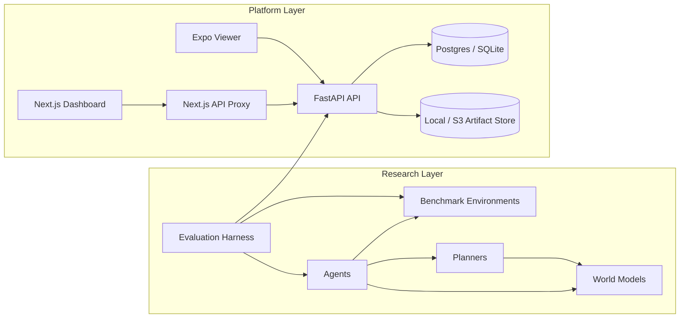
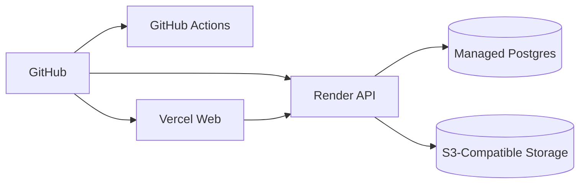

# worldmodel-gym

WorldModel Gym is an end-to-end benchmark platform for long-horizon planning agents. It combines reproducible benchmark environments, planner and world-model baselines, a FastAPI submission service, and a polished Next.js leaderboard into one deployable monorepo.

## Why This Repo Stands Out

- Reproducible benchmark tasks designed around sparse rewards, partial observability, and procedural generalization
- Modular research stack spanning environments, agents, planners, and world models
- Production-minded backend with Alembic migrations, scoped API keys, rate limiting, readiness checks, structured logging, and Prometheus metrics
- Modern frontend with a custom editorial product UI, same-origin proxying, SEO metadata, and Playwright smoke coverage
- Full-stack delivery workflow with GitHub Actions, Render deployment support, and Vercel deployment support

## Stack

- `core/`: benchmark environments, traces, and evaluation harness
- `agents/`: baseline agents and agent registry
- `planners/`: planning algorithms such as MCTS and MPC-CEM
- `worldmodels/`: deterministic, stochastic, and ensemble world model baselines
- `server/`: FastAPI API, auth, migrations, storage, CLI, and demo-data seeding
- `web/`: Next.js App Router dashboard and API proxy
- `mobile/`: Expo-based mobile viewer
- `paper/`: manuscript sources and generated PDF artifacts

## Architecture



## Deployment Topology



The default production shape is:

- FastAPI API on Render
- Next.js dashboard on Vercel
- managed Postgres for run metadata
- local or S3-compatible storage for trace and metrics artifacts
- browser requests routed through the Next.js proxy instead of direct cross-origin API calls

## Core Product Capabilities

- create benchmark runs through the API
- upload metrics, traces, and config artifacts
- inspect public leaderboard data by track
- browse tasks and benchmark context from the web dashboard
- verify public deployment health with readiness, liveness, and smoke checks
- seed demo leaderboard data for first-run and demo environments

## Local Quickstart

```bash
make setup
make demo
```

`make demo` will:

- start the API and web stack with Docker when available
- fall back to a local API process if Docker is unavailable
- create a benchmark run
- upload artifacts through the API
- populate the leaderboard flow end to end

Open:

- [http://localhost:3000](http://localhost:3000)
- [http://localhost:8000/docs](http://localhost:8000/docs)

Local development uses built-in defaults. If you need overrides, export environment variables in your shell or configure them in your deployment provider. Do not commit env files to the repository.

## Developer Commands

```bash
make lint
make test
make demo
make seed-demo
make create-api-key NAME=local-writer SCOPE=runs:write
make verify-deployment
make deploy
make stop
make deploy-public
make stop-public
make deploy-vercel
```

## Production Features

- Alembic migrations replace implicit schema creation
- scoped API keys support `runs:write` and admin-style access control
- legacy upload-token support exists only as a compatibility path and can be disabled
- authenticated writes and public reads are rate limited separately
- structured logs include request IDs, durations, and startup/readiness events
- `/healthz`, `/readyz`, and `/metrics` expose runtime health and monitoring hooks
- the frontend uses a same-origin proxy route for safer browser-to-API access
- demo data seeding and demo-run upload tooling are built into the repo

## Auth, Data, and Operations

Create a scoped API key:

```bash
.venv/bin/python -m worldmodel_server.cli create-api-key \
  --name production-writer \
  --scope runs:write
```

Seed demo data:

```bash
.venv/bin/python -m worldmodel_server.cli seed-demo-data --force
```

Upload a demo run against a local or hosted API:

```bash
.venv/bin/python scripts/demo_run.py \
  --api-base http://localhost:8000
```

Verify the full public deployment:

```bash
.venv/bin/python scripts/verify_deployment.py \
  --api-base https://worldmodel-gym-api.onrender.com \
  --web-base https://world-model-gym.vercel.app
```

Useful runtime endpoints:

- API liveness: `/healthz`
- API readiness: `/readyz`
- API metrics: `/metrics`
- web smoke path: `/api/proxy/api/leaderboard?track=test`

## Deployment Notes

- Deploy the API from [render.yaml](render.yaml)
- Deploy the web app from the `web/` root directory in Vercel
- Store production secrets in Render and Vercel, not in repo files
- Switch artifact storage to S3-compatible storage for durable production uploads
- Remove `WMG_BOOTSTRAP_API_KEY` after the first durable writer key is created

Full deployment and operations references:

- [docs/DEPLOYMENT.md](docs/DEPLOYMENT.md)
- [docs/OPERATIONS.md](docs/OPERATIONS.md)
- [SECURITY.md](SECURITY.md)
- [ROADMAP.md](ROADMAP.md)

## Quality Gates

- Ruff lint and formatting checks
- Pytest coverage for backend behavior
- Next.js production build verification
- Playwright smoke tests for the web flow
- scheduled production smoke checks against public deployment surfaces

## Resume-Friendly Highlights

- Built and shipped a full-stack benchmark product spanning environments, planners, model baselines, backend APIs, and frontend dashboards
- Hardened the backend with migrations, auth, rate limiting, structured logging, and cloud deployment support
- Added deployment verification, browser E2E coverage, and production smoke automation on top of standard CI
- Designed a custom frontend UI system rather than relying on a boilerplate template

## License

[MIT](LICENSE)
