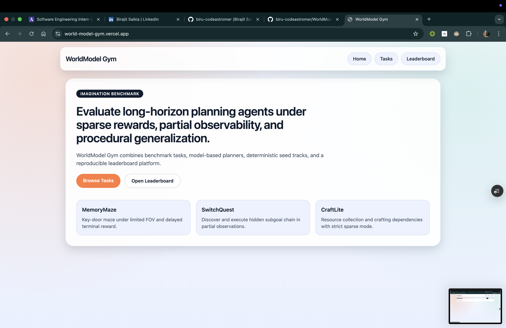
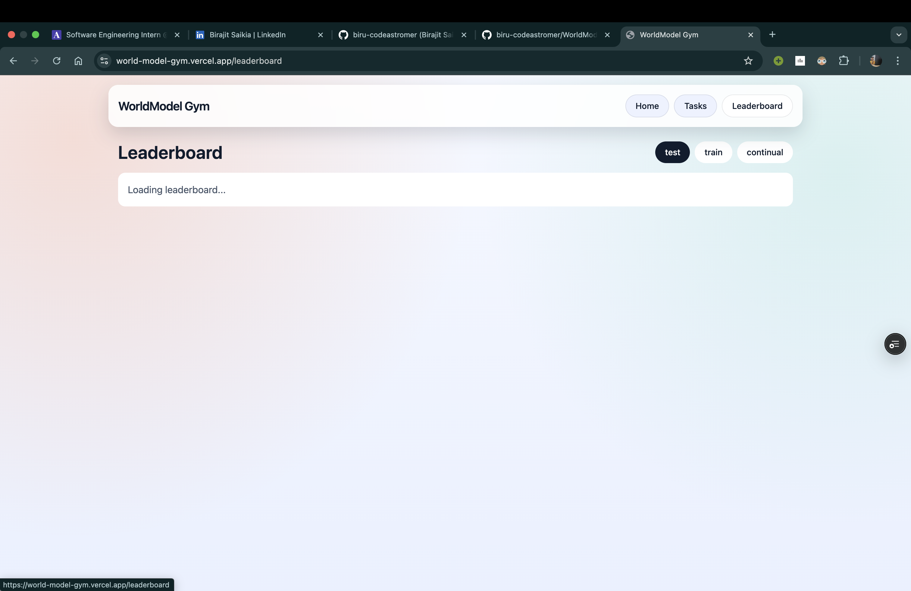
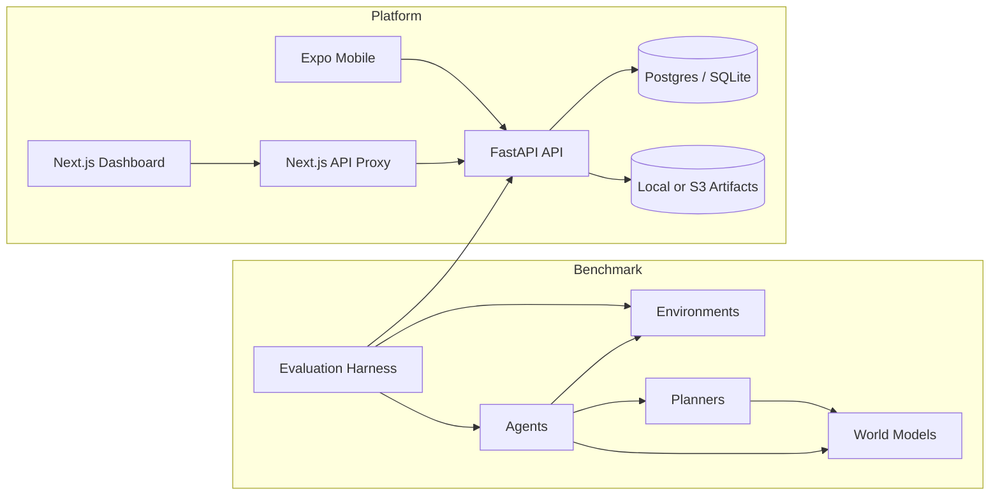
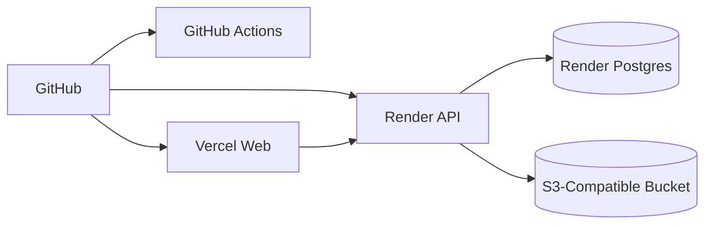

# worldmodel-gym

WorldModel Gym is a production-ready benchmark platform for long-horizon planning agents. It combines reproducible environments, planner/world-model baselines, a FastAPI submission service, and a Next.js leaderboard dashboard into one deployable monorepo.

## Screenshots





## What makes this repo strong

- Reproducible benchmark tasks for sparse rewards, partial observability, and procedural generalization
- FastAPI backend with Alembic migrations, scoped API keys, rate limiting, readiness checks, and structured logging
- Pluggable artifact storage with local and S3-compatible backends
- Next.js dashboard with proxy-based API access, seeded demo data support, metadata/SEO, and Playwright smoke tests
- CI coverage for Ruff, pytest, Next.js production builds, and browser E2E verification

## Quickstart

```bash
make setup
make demo
```

Local development uses built-in defaults. If you need overrides, export environment variables in your shell instead of committing env files to the repo.

`make demo` will:

- start the API + web stack with Docker when available
- fall back to local API execution when Docker is unavailable
- create a benchmark run
- upload artifacts through the API
- populate the leaderboard

Open:

- [http://localhost:3000](http://localhost:3000)
- [http://localhost:8000/docs](http://localhost:8000/docs)

## Architecture



## Production Features

- Alembic migrations replace implicit `create_all()` table creation
- API writes are protected by scoped API keys with a legacy upload-token compatibility path
- Public API traffic is rate limited and logged with request IDs
- Prometheus metrics are exposed from the server at `/metrics`
- Browser clients use the Next.js proxy route instead of direct cross-origin calls to the API
- Demo leaderboard data can be seeded with `WMG_SEED_DEMO_DATA=true`

## Deployment Topology



Full deployment instructions live in [docs/DEPLOYMENT.md](docs/DEPLOYMENT.md).

## Auth and Operations

Create a scoped API key:

```bash
.venv/bin/python -m worldmodel_server.cli create-api-key \
  --name production-writer \
  --scope runs:write
```

Seed demo data:

```bash
.venv/bin/python -m worldmodel_server.cli seed-demo-data --force
```

Upload a demo run against a live or local API:

```bash
.venv/bin/python scripts/demo_run.py --api-base http://localhost:8000
```

Verify the public deployment end to end:

```bash
.venv/bin/python scripts/verify_deployment.py \
  --api-base https://worldmodel-gym-api.onrender.com \
  --web-base https://world-model-gym.vercel.app
```

Operational runbook:

- [docs/OPERATIONS.md](docs/OPERATIONS.md)
- [SECURITY.md](SECURITY.md)

## Monorepo Layout

- `core/`: environments, traces, evaluation harness
- `planners/`: MCTS, MPC-CEM, and trajectory-sampling planners
- `worldmodels/`: deterministic, stochastic, and ensemble world models
- `agents/`: baseline agents and registry
- `server/`: FastAPI API, auth, migrations, storage, and seeding
- `web/`: Next.js dashboard and proxy routes
- `mobile/`: Expo mobile viewer
- `paper/`: manuscript sources and generated PDF

## Developer Commands

```bash
make lint
make test
make demo
make seed-demo
make create-api-key NAME=local-writer SCOPE=runs:write
make verify-deployment
make deploy
make stop
make deploy-public
make stop-public
make deploy-vercel
```

## Resume-Friendly Highlights

- Shipped an end-to-end benchmark platform spanning environments, planners, model baselines, backend APIs, and frontend dashboards
- Hardened the service with migrations, auth, rate limiting, structured logging, and cloud deployment support
- Added automated browser verification and production smoke checks on top of standard lint/test/build CI

## License

[MIT](LICENSE)
