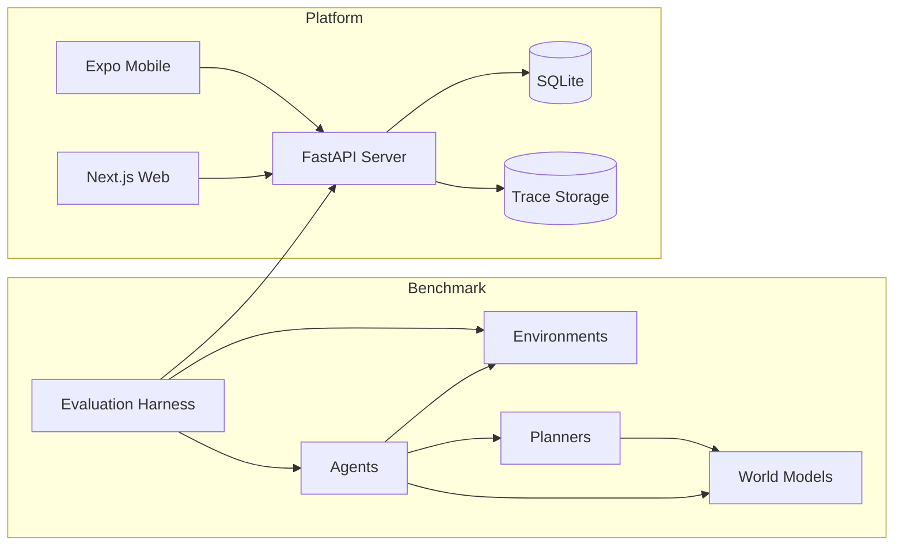

# Architecture

```mermaid
flowchart LR
    subgraph Benchmark
      E[Environments]
      A[Agents]
      P[Planners]
      W[World Models]
      H[Evaluation Harness]
    end

    subgraph Platform
      S[FastAPI Server]
      DB[(SQLite)]
      FS[(Trace Storage)]
      WEB[Next.js Web]
      MOB[Expo Mobile]
    end

    A --> E
    A --> P
    A --> W
    P --> W
    H --> A
    H --> E
    H --> S
    S --> DB
    S --> FS
    WEB --> S
    MOB --> S
```
