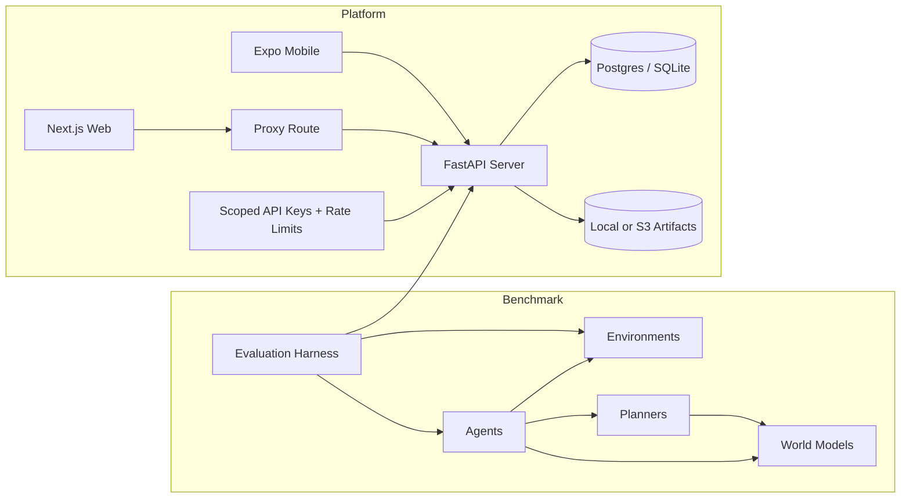

# Architecture

```mermaid
flowchart LR
    subgraph Benchmark
      E["Environments"]
      A["Agents"]
      P["Planners"]
      W["World Models"]
      H["Evaluation Harness"]
    end

    subgraph Platform
      S["FastAPI Server"]
      AUTH["Scoped API Keys + Rate Limits"]
      DB[("Postgres / SQLite")]
      FS[("Local or S3 Artifacts")]
      WEB["Next.js Web"]
      PROXY["Proxy Route"]
      MOB["Expo Mobile"]
    end

    A --> E
    A --> P
    A --> W
    P --> W
    H --> A
    H --> E
    H --> S
    AUTH --> S
    S --> DB
    S --> FS
    WEB --> PROXY
    PROXY --> S
    MOB --> S
```
